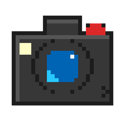

# HiResShot

**HiResShot** 是一个 Minecraft 截图增强模组，允许玩家截取远超当前屏幕分辨率的图片（如 4K、8K 甚至更高）。

它通过调整 Framebuffer（帧缓冲区）大小来实现原生的高分辨率渲染，而非简单的像素拉伸。该模组旨在解决普通截图分辨率不足的问题，非常适合用于制作壁纸、海报或印刷品。

支持版本：**1.12.2 (Forge)** / **1.20.1 (Forge/NeoForge)** / **1.21.1 (NeoForge)**

---

## 主要功能 | Features

*   **极高分辨率**：支持最高 64 倍于屏幕分辨率的截图（受显卡显存限制）。
*   **光影兼容**：专为光影包（Shaders）优化的“实时模式”，解决截图变黑或曝光不足的问题。
*   **突破硬件限制**：提供“CPU 混合放大模式”，即使显卡显存不足，也能通过算法合成超大分辨率图片（如 16K+）。
*   **自定义尺寸**：支持设置固定的宽度和高度（例如 21:9 超宽屏或手机竖屏壁纸）。
*   **自动清理**：截图时自动隐藏 GUI（界面）、准星以及玩家实体（防止自身阴影遮挡）。

## 截图模式 | Capture Modes

本模组提供三种截图模式，以适应不同的需求和硬件条件：

### 1. 实时模式 (Real-time Mode) —— **推荐**
*   **适用场景**：开启光影（Shaders）、TAA 抗锯齿或动态模糊时。
*   **原理**：将游戏分辨率调整为目标大小，并继续运行指定帧数（可配置），等待光影渲染管线稳定后再保存。
*   **特点**：兼容性最好，所见即所得。截图过程中游戏会短暂卡顿。

### 2. 瞬间模式 (Instant Mode)
*   **适用场景**：原版画质、无复杂光影。
*   **原理**：瞬间冻结画面，在后台强制渲染多帧并保存。
*   **特点**：速度快，干扰小。

### 3. CPU 放大模式 (CPU Upscale Mode)
*   **适用场景**：目标分辨率极高（如 32K），超出了显卡承受范围。
*   **原理**：先以显卡允许的最大尺寸（如 16K）渲染底图，再利用 CPU 进行高质量双三次插值（Bicubic Interpolation）放大到目标尺寸。
*   **特点**：可以生成任意大小的图片，防止显存溢出导致的游戏崩溃。

## 使用方法 | Usage

1.  在游戏中按 **F9** 键（默认）触发截图。
2.  截图文件将保存在 `.minecraft/screenshots/` 目录下，文件名带有 `_hrs` 后缀。
3.  **配置**：
    *   **1.12.2**：点击 Mods -> HiResShot -> Config。
    *   **1.20.1+**：需要安装 **Cloth Config API**，点击 Mods 列表中的配置按钮即可打开图形化界面。

## 配置项详解 | Configuration

*   **Multiplier**: 放大倍数（2x - 64x）。
*   **Use Custom Resolution**: 是否启用自定义分辨率（覆盖倍数设置）。
*   **Capture Mode**: 选择上述三种模式之一。
*   **Real-time Delay**: 实时模式下的等待帧数。如果截图偏暗或光影未加载完成，请调大此数值（推荐 20-60）。
*   **Hide Player**: 是否隐藏玩家模型（防止光影下产生多余阴影）。
*   **Hide GUI**: 是否隐藏GUI（包括第一人称状态下的手部）。

## 安装依赖 | Requirements

*   **1.20.1 / 1.21.1**: 需要 [Cloth Config API](https://www.curseforge.com/minecraft/mc-mods/cloth-config) 以显示配置界面。